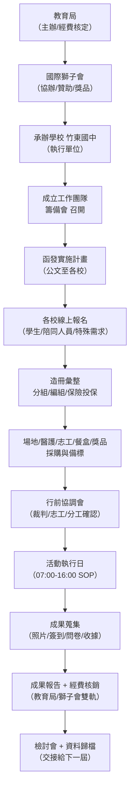
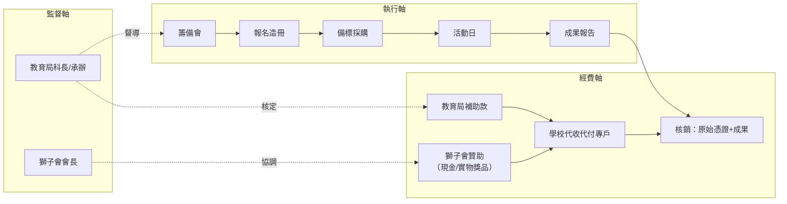
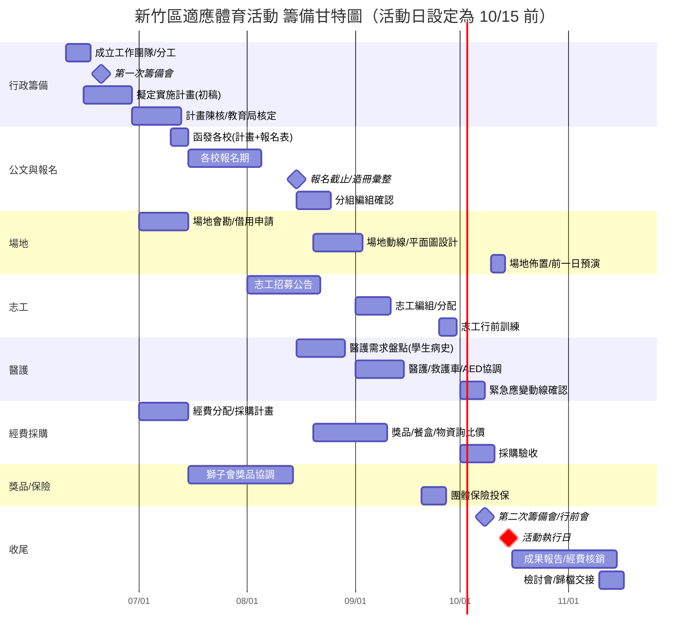
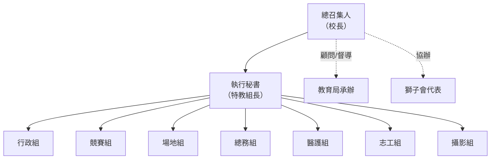

# 新竹區國中小中重度特教班適應體育活動
# 縣級大型活動專案管理實戰手冊（承辦：竹東國中）

> 版本：v1.0｜適用對象：第一次接任之特教組長｜辦理時間：10 月中旬前  
> 規模：20～30 校、學生 250～300 名、教師/助理員/工作人員約 100 名  
> 共同辦理單位：新竹縣政府教育局 × 國際獅子會 × 竹東國中

---

## ⚠️ 開工前必讀（給第一次接手的你）

1. **這不是「企劃書」，是「專案」。** 企劃書是寫給長官看的；專案是讓你活下來的。本手冊以「跑得動、核得了銷、出事有人扛」為目標。
2. **三個單位 = 三套規矩。** 教育局要公文與核銷；獅子會要曝光與名譽；學校要安全與不被客訴。每一個決定都要同時通過這三關。
3. **錢的問題先搞清楚再做事。** 經費來源（教育局補助／獅子會贊助）決定核銷方式、決定能不能買餐盒、能不能發鐘點費。**第一週就要把經費結構問到底。**
4. **特教活動的核心是「安全」與「成功經驗」，不是「比賽輸贏」。** 所有設計都要回到「中重度學生也能參與、也能得獎、也不會受傷」。

---

# 第一部分　活動專案全貌圖

## 1-1　專案總流程（Mermaid）

## 1-2　三方權責 + 金流並行圖（進階版）

> **看圖重點：** 金流（經費軸）與執行（執行軸）是兩條平行線，最後在「成果報告＋核銷」收口。**只要其中一條斷了，整個案子就核銷不掉。** 你的工作就是讓兩條線同時跑、同時到。

---

# 第二部分　RACI 權責矩陣

## 2-1　RACI 代號說明

| 代號 | 意義 | 說明 |
|---|---|---|
| **R** | Responsible 執行者 | 實際動手做的人（可多人） |
| **A** | Accountable 最終負責 | 一件事只能有一個 A，扛責、簽核、被究責 |
| **C** | Consulted 諮詢 | 事前要問過他、聽他意見 |
| **I** | Informed 告知 | 事後要讓他知道結果 |

## 2-2　完整 RACI 矩陣

| 工作項目 / 角色 | 教育局 | 科長 | 校長 | 主任 | **特教組長** | 體育組 | 總務處 | 會計室 | 校護 | 獅子會 | 志工 |
|---|---|---|---|---|---|---|---|---|---|---|---|
| 核定實施計畫與經費 | **A** | R | C | C | R | I | I | C | I | C | I |
| 計畫撰寫/修訂 | C | C | A | C | **R** | C | I | C | C | C | I |
| 召開籌備會 | I | I | A | R | **R** | C | C | C | C | C | I |
| 發文各校（報名通知） | I | I | A | R | **R** | I | C | I | I | I | I |
| 各校報名彙整造冊 | I | I | I | C | **A/R** | C | I | I | C | I | I |
| 競賽項目設計 | I | C | I | C | **A/R** | R | I | I | C | C | I |
| 場地規劃/佈置 | I | I | C | A | C | **R** | R | I | I | I | R |
| 採購（獎品/餐盒/物資） | I | I | C | A | C | C | **R** | C | I | C | I |
| 經費核銷/憑證 | C | C | A | C | C | I | R | **R** | I | C | I |
| 學生保險投保 | I | I | C | A | **R** | I | C | C | C | I | I |
| 醫護規劃/救護動線 | I | I | C | C | C | C | C | I | **A/R** | I | C |
| 志工招募/編組/訓練 | I | I | C | A | **R** | C | I | I | I | C | R |
| 獎品/贊助協調 | I | I | C | C | **R** | I | C | I | I | **A** | I |
| 貴賓邀請/接待 | C | C | **A** | R | R | I | C | I | I | C | C |
| 新聞稿/成果宣傳 | C | C | A | R | **R** | I | I | I | I | C | I |
| 活動當日總指揮 | I | I | **A** | R | R | R | R | I | R | C | R |
| 緊急事件處理 | I | I | **A** | R | R | R | R | I | R | C | R |
| 成果報告/結案 | C | C | A | C | **R** | C | R | R | I | I | I |

> **給特教組長的話：** 表中你出現最多次 **R（執行）**，有幾項是 **A（最終負責）**——「報名造冊」「競賽設計」「志工」是你逃不掉的三大主戰場。但**「經費核銷」的 A 是校長、R 是會計與總務，你只是 C/I**——千萬不要把核銷扛到自己身上，但要主動「催件」。**「緊急事件」與「當日總指揮」的 A 一定要是校長**，你只是執行，這是保護你自己。

---

# 第三部分　完整甘特圖（6 月～10 月）

## 3-1　Mermaid 甘特圖

## 3-2　時程對照表（可直接複製到 Word）

| 項目 | 6 月 | 7 月 | 8 月 | 9 月 | 10 月 | 關鍵提醒 |
|---|---|---|---|---|---|---|
| **籌備會** | 第一次籌備會(中) | — | — | — | 行前會(初) | 至少 2 次，活動前一週務必再開 |
| **公文** | 計畫初稿 | 函發各校(中) | 催報名公文 | — | 感謝函/出席公文 | 公文一定要留「報名截止日」明確日期 |
| **報名** | — | 開放報名 | 截止/造冊(中) | 補報名處理 | 最終名冊定版 | 一定會有遲交，預留 1 週緩衝 |
| **場地** | — | 會勘/借用 | 平面圖 | 動線確認 | 佈置/預演 | 雨天備案場地同步借 |
| **志工** | — | — | 招募 | 編組/訓練 | 報到分工 | 志工：學生＝1:2 以上 |
| **醫護** | — | — | 病史盤點 | 醫護協調 | 動線確認/到位 | 一定要有救護車或鄰近醫院聯繫 |
| **經費** | 經費結構確認 | 採購計畫 | 詢比價 | 簽核 | 驗收/核銷起跑 | 先確認可不可「代收代付」 |
| **獎品** | — | 獅子會協調 | 確認品項 | 製作/採購 | 分裝/檢查 | 人人有獎，數量+10% |
| **餐盒** | — | — | 詢價 | 確認葷素/過敏 | 前3日下訂/當日驗收 | 數量=學生+陪同+志工+貴賓+10% |
| **保險** | — | — | 名冊預估 | 投保(下旬) | 核對保單 | 名冊定版後立刻投保 |
| **成果報告** | — | — | — | 範本準備 | 蒐集/撰寫 | 照片、簽到、收據當天就要收齊 |

> **死線提醒：** 8/15 報名造冊、9/20 投保、10/8 行前會、10/15 活動日——這四個是不能跳票的硬節點。其他都可滑動，這四個不行。

---

# 第四部分　第一次籌備會簡報大綱（24 頁）

> 用途：你召開校內 + 跨單位第一次籌備會的簡報。每頁含「標題／內容重點／應呈現資料」。

| 頁 | 標題 | 內容重點 | 應呈現資料 |
|---|---|---|---|
| 1 | 封面 | 活動全名、主協辦單位 LOGO、日期、承辦學校 | 教育局/獅子會/竹東國中三方 LOGO、活動 Slogan |
| 2 | 會議議程 | 今日會議流程、預計結束時間、決議事項 | 議程表（含報告人、時間分配） |
| 3 | 活動緣起與目的 | 為何辦、政策依據、適應體育意義 | 特教法/十二年國教課綱適應體育條文摘錄 |
| 4 | 活動定位與精神 | 「重參與、重成功經驗、非競技導向」 | 一句核心理念 + 往年照片(若有) |
| 5 | 辦理單位與分工 | 三方角色、誰出錢誰出力誰掛名 | 主辦/協辦/承辦/贊助 一覽表 |
| 6 | 參與對象與規模 | 20-30 校、250-300 生、100 工作人員 | 預估校數、人數分布表 |
| 7 | 活動日期與地點 | 確定/暫定日期、場地、雨天備案 | 行事曆截圖、場地平面初圖 |
| 8 | 競賽/活動項目設計 | 分組原則、項目清單、適應化調整 | 項目表（含障別調整說明） |
| 9 | 分組與報名規劃 | 障別/年級/能力分組、報名方式 | 分組架構圖、線上報名表 demo |
| 10 | 組織架構與工作分組 | 9 大組、各組召集人 | 組織圖（第五部分） |
| 11 | RACI 權責說明 | 誰負責什麼、避免互踢皮球 | RACI 摘要表 |
| 12 | 整體時程(甘特圖) | 各階段死線、關鍵里程碑 | 甘特圖（第三部分） |
| 13 | 經費來源與架構 | 補助/贊助金額、可動支項目 | 經費收支預算表 |
| 14 | 採購與核銷原則 | 採購流程、憑證要求、誰簽核 | 採購流程圖、憑證清單 |
| 15 | 場地規劃與動線 | 報到、競賽、休息、醫護、停車動線 | 場地平面圖（含動線箭頭） |
| 16 | 志工招募與配置 | 來源、人數、編組、訓練時間 | 志工需求表、1:2 配置說明 |
| 17 | 醫護與安全計畫 | 醫護站、救護動線、特殊病史處理 | 醫護配置圖、緊急聯絡網 |
| 18 | 餐盒/物資/保險 | 數量估算、葷素過敏、投保時程 | 物資清單、保險規劃表 |
| 19 | 獎品與獅子會協調 | 人人有獎原則、獎品品項、贊助對接 | 獎品清單、獅子會窗口 |
| 20 | 風險管理重點 | Top 10 高風險、應變機制 | 風險矩陣摘要（第七部分） |
| 21 | 各校配合事項 | 報名、陪同人力、學生資料、接送 | 致各校須知一頁版 |
| 22 | 待決議事項 | 今天必須拍板的事(日期/分組/經費) | 決議清單（勾選欄） |
| 23 | 下一步與分工認領 | 各組回去要做什麼、回報日期 | 任務認領表（含負責人簽名欄） |
| 24 | 聯絡窗口與 Q&A | 各組窗口、群組 QR、提問 | 聯絡資訊表、LINE 群 QR Code |

> **主持技巧：** 第 22 頁（待決議）是整場會議的重點。**沒拍板就散會 = 白開。** 至少要當場定下：活動日期、分組原則、經費可動支範圍、各組召集人。

---

# 第五部分　工作分組架構

## 5-1　組織圖（Mermaid）

## 5-2　各組工作說明（可複製到 Word）

| 組別 | 召集人建議 | 工作內容 | 人數配置 | 注意事項 |
|---|---|---|---|---|
| **總召集人** | 校長 | 對外代表、重大決策、緊急事件拍板、貴賓接待 | 1 人 | 真正出事要扛責的人，所有對外公文掛名 |
| **執行秘書** | 特教組長 | 統籌協調、進度控管、各組溝通樞紐、計畫/核銷催件 | 1 人(+1 助理) | 你就是中樞，事情不會自己動，要主動追 |
| **行政組** | 特教/輔導同仁 | 公文、報名彙整、造冊、簽到、保險、成果報告 | 3-4 人 | 文書與時程的命脈，細心度第一 |
| **競賽組** | 體育組長 | 項目設計、規則、裁判、計分、頒獎流程 | 4-6 人 | 規則要「適應化」，裁判要懂特教學生 |
| **場地組** | 總務/體育 | 場地佈置、動線、桌椅、音響、指示牌、收場 | 6-8 人(含工友) | 動線一亂全場亂，輪椅無障礙必查 |
| **總務組** | 總務主任 | 採購、餐盒、物資、經費、核銷憑證 | 3-4 人 | 憑證當天就要收，事後補件是惡夢 |
| **醫護組** | 校護 | 醫護站、急救、學生病史、救護聯繫 | 2-3 人(可商請衛生所) | 高血壓/癲癇/氣喘學生名單要在手上 |
| **志工組** | 特教組長/輔導 | 志工招募、編組、訓練、當日帶領學生 | 統籌 2 人 + 志工 50-80 人 | 志工:學生 ≥ 1:2，中重度需 1:1 |
| **攝影組** | 資訊/熱心同仁 | 活動紀錄、成果照片、頒獎拍照、新聞稿素材 | 2-3 人 | 照片是核銷與宣傳命脈，肖像權留意 |

> **人力總量檢核：** 工作人員約 100 名 = 校內教職員 + 各校陪同教師/助理員 + 招募志工。**各校陪同的老師與助理員，才是當天帶學生的主力**，志工是補強，不能反過來依賴志工帶不熟悉的中重度學生。

---

# 第六部分　活動當日 SOP（07:00–16:00）

> 以「每 30 分鐘一節點」呈現，列出工作人員／志工／校護／裁判／獅子會／貴賓各自任務。

| 時間 | 工作人員 | 志工 | 校護 | 裁判 | 獅子會 | 貴賓 |
|---|---|---|---|---|---|---|
| **07:00** | 各組到位、開門、總務開始佈置 | 志工組長到位、領識別證 | 醫護站開設、急救箱備妥 | — | — | — |
| **07:30** | 報到桌、指示牌、音響測試 | 志工陸續報到、分組站位 | 確認救護車/AED位置 | 裁判長到、領計分表 | — | — |
| **08:00** | 場地最終檢查、停車引導待命 | 志工就定位、複習帶班動線 | 巡場、確認無障礙動線 | 裁判到各賽場定位 | 獅子會布條/攤位佈置 | — |
| **08:30** | 各校報到（簽到、領物資袋） | 志工接學生、帶往休息區 | 接收各校學生病史/用藥 | 賽場器材最後檢查 | 獅子會報到、就坐區 | 貴賓陸續抵達、接待引導 |
| **09:00** | 開幕典禮主持、流程控管 | 志工陪同學生入場就座 | 醫護站待命、巡場 | 列席開幕、待命 | 致詞（會長）、頒贈 | 貴賓致詞、合影 |
| **09:30** | 開幕結束、引導進場分流 | 志工帶學生至第一賽場 | 第一線巡場（防中暑/情緒） | 各賽場就位、宣布規則 | 陪同貴賓參觀 | 參觀各賽場、互動 |
| **10:00** | 競賽 A 開始、計分回收 | 志工協助學生完成關卡 | 機動支援、補水提醒 | 執法、計分、記錄 | 攤位互動、發小禮物 | 觀賽、頒小獎、拍照 |
| **10:30** | 競賽 A 進行、廣播協調 | 志工輪替、照顧情緒學生 | 處理小擦傷/不適 | 持續執法計分 | 協助頒獎 | 巡場、可先行離席者送客 |
| **11:00** | 競賽 B 換場、動線維持 | 志工帶學生換賽場/休息 | 巡場、留意高溫時段 | 第二輪賽事就位 | 攤位/陪伴 | 部分貴賓離場、致謝 |
| **11:30** | 餐盒清點、分送各區準備 | 志工協助領餐、過敏確認 | 用藥提醒、餐前洗手宣導 | 上午賽事計分彙整 | 協助用餐區 | 留場貴賓共餐或送客 |
| **12:00** | 午餐、垃圾分類、場地維持 | 志工陪學生用餐、照顧 | 午休巡視、突發處理 | 裁判休息、核對成績 | 用餐/休息 | — |
| **12:30** | 午休、下午流程確認 | 志工輪流用餐、輪值看顧 | 醫護站待命 | 成績複核、頒獎名單確認 | 休息 | — |
| **13:00** | 下午活動廣播集合 | 志工集合學生至賽場 | 午後巡場（防嗜睡/低血糖） | 下午賽事規則宣布 | 重新就位 | 下午場貴賓抵達(如有) |
| **13:30** | 競賽 C 開始 | 志工協助闖關/陪伴 | 機動支援 | 執法計分 | 攤位互動 | 觀賽 |
| **14:00** | 競賽 C 進行、頒獎區佈置 | 志工照顧、輪替休息 | 巡場、處理疲勞學生 | 賽事收尾、彙整成績 | 準備獎品上台 | 頒獎貴賓就位 |
| **14:30** | 成績彙整、頒獎流程準備 | 志工帶學生至頒獎區集合 | 待命 | 提交最終成績單 | 獎品/獎狀定位 | 頒獎貴賓待命 |
| **15:00** | 頒獎/閉幕典禮主持 | 志工協助學生上台領獎 | 醫護站留守至散場 | 列席、協助唱名 | 頒獎、致詞 | 頒獎、致詞、合影 |
| **15:30** | 閉幕、各校簽退領回名冊 | 志工送學生至接送區 | 收醫護站、清點藥品 | 裁判歸還器材、簽退 | 拍照、撤攤 | 致謝送客 |
| **16:00** | 全場復原、垃圾清運、檢討 | 志工協助收場、簽退領證明 | 醫護station撤收、回報 | 全數離場 | 撤收完畢 | 全數離場 |

> **SOP 鐵律：**  
> 1. **每節點都要有「廣播」與「對表」**——全場用同一個時間軸，靠廣播推進。  
> 2. **學生不能離開志工/老師視線**——交接一定要「人對人、簽名確認」。  
> 3. **頒獎前一定要把成績複核兩次**——特教場最怕頒錯獎、漏掉人。

---

# 第七部分　風險管理表（35 項）

> 機率/影響：高(H)／中(M)／低(L)。表已可直接複製到 Word。

| # | 風險項目 | 機率 | 影響 | 預防措施 | 緊急應變 |
|---|---|---|---|---|---|
| 1 | 活動當日下雨 | H | H | 備雨天室內場地、棚架租借、雨備計畫提前公告 | 啟動雨備、縮短戶外項目、改室內闖關 |
| 2 | 高溫/中暑 | H | H | 遮陽棚、補水站、避開正午戶外、灑水降溫 | 中暑 SOP：陰涼處、降溫、通報校護、必要送醫 |
| 3 | 學生走失 | M | H | 識別手環(含校名/帶隊人)、定點集合、人數三次清點 | 立即廣播、封鎖出入口、清點各組、報案備案 |
| 4 | 學生情緒失控 | H | M | 安排「安靜角」、熟悉的老師陪同、降低噪音刺激 | 帶離現場至安靜區、原校老師介入、必要時聯繫家長 |
| 5 | 學生癲癇/抽搐發作 | M | H | 事前收集病史名單、用藥資訊、座位靠近醫護 | 癲癇 SOP：側躺保護、勿塞物、計時、超過5分送醫 |
| 6 | 學生氣喘/過敏發作 | M | H | 收集過敏原、餐盒標示、學生自備藥確認 | 用備援藥、移除過敏原、通報醫護、送醫 |
| 7 | 餐盒數量不足 | M | H | 數量=實到+陪同+志工+貴賓+10%，前3日定數 | 機動加訂、超商備援、優先供應學生 |
| 8 | 餐盒食安/食物中毒 | L | H | 慎選有 HACCP 廠商、留樣、當日製作當日送 | 保留餐盒樣本、通報衛生局、就醫、列冊追蹤 |
| 9 | 音響/麥克風故障 | M | M | 備用麥克風2支、電池、提前測試、找懂設備的人 | 切換備援、用大聲公、手勢與舉牌指揮 |
| 10 | 裁判缺席/遲到 | M | M | 每賽場備候補裁判、前一日確認到場 | 候補頂上、行政人員受訓臨時支援 |
| 11 | 志工未到/缺額 | H | M | 超額招募(需求×1.2)、前一日確認、簽到管控 | 機動調度、老師補位、合併賽場 |
| 12 | 志工不懂特教學生 | H | M | 行前訓練(障別認識/帶領技巧)、發帶班手冊 | 配對資深老師、即時諮詢窗口 |
| 13 | 各校報名遲交 | H | M | 明確截止日、設提醒、預留1週緩衝 | 個別電話催、彈性收尾、不影響造冊主流程 |
| 14 | 報名人數與實到落差大 | H | M | 報名後再次電話確認、要求各校回填實到 | 餐盒/獎品彈性、現場機動調整分組 |
| 15 | 學生臨時請假/未到 | H | L | 預估缺席率(約10-15%)納入採購 | 物資與獎品有餘裕、賽程不卡關 |
| 16 | 經費核銷憑證不齊 | M | H | 採購前確認憑證要求、當天收齊收據/簽到 | 立即補單、與會計確認替代憑證 |
| 17 | 採購流程不及/延誤 | M | H | 提前一個月詢比價、預留簽核時間 | 緊急採購程序、改向有庫存廠商 |
| 18 | 獅子會贊助未到位 | M | H | 早期書面確認金額/品項、留書面紀錄 | 校內預算先墊、調整獎品規格 |
| 19 | 保險漏保/名冊有誤 | M | H | 名冊定版後立即投保、核對到每一人 | 緊急加保、確認保單生效時間 |
| 20 | 學生受傷(跌倒/碰撞) | M | M | 場地軟墊、移除尖角、賽前安全宣導 | 醫護處理、填意外紀錄、通知家長、走保險 |
| 21 | 輪椅/行動不便者動線受阻 | M | M | 無障礙動線勘查、斜坡、淨空通道 | 志工專責推送、改道、人力協助 |
| 22 | 廁所不足/無障礙廁所缺 | M | M | 事前盤點、增設流動廁所、標示清楚 | 引導至最近無障礙廁所、志工陪同 |
| 23 | 停車/接送動線混亂 | M | M | 規劃接送區、停車證、交通指揮志工 | 機動疏導、廣播調整、聯繫校警 |
| 24 | 開閉幕流程超時 | H | L | 致詞限時、流程預演、計時牌提醒 | 主持果斷收尾、刪減非必要環節 |
| 25 | 貴賓臨時增加/變動 | H | L | 預留接待彈性、座位/餐盒備用 | 機動接待、加備餐盒、調整致詞順序 |
| 26 | 頒獎名單錯誤/漏人 | M | H | 成績複核兩次、人人有獎設計 | 現場補頒、事後郵寄、誠懇致歉 |
| 27 | 獎品數量不足/品項錯 | M | M | 數量+10%、人人有獎、提前清點分裝 | 機動補、通用獎品備援 |
| 28 | 攝影/紀錄缺漏 | M | M | 指定攝影分工、頒獎必拍、雲端即時備份 | 手機補拍、向各校蒐集照片 |
| 29 | 肖像權/個資爭議 | L | M | 報名時取得拍攝同意書、不公開特定學生 | 撤照、去識別化、僅內部核銷用 |
| 30 | 場地臨時無法使用 | L | H | 書面借用確認、前一日確認、備案場地 | 啟動備案場地、改期最後手段 |
| 31 | 停電/電力不足 | L | H | 確認電源容量、發電機備援、延長線足量 | 切換發電機、改用電池設備、縮減用電 |
| 32 | 大型集合人潮推擠 | M | M | 分流入場、分區集合、動線單向 | 廣播分批、志工拉線控管 |
| 33 | 工作人員/志工受傷 | L | M | 搬重物注意、保險納入工作人員 | 醫護處理、職災/保險程序 |
| 34 | 媒體/長官突訪應對失當 | L | M | 統一發言窗口(校長/主任)、準備新聞稿 | 引導至發言窗口、提供書面資料 |
| 35 | 活動後核銷拖延逾期 | M | H | 設定核銷死線、成果與憑證當天收齊 | 專人催件、向教育局申請展延(書面) |

> **風險管理心法：** 你不可能消滅風險，只能「降低機率」+「準備應變」。**機率高×影響高（1、2、3、4、11、12）這六項，是你睡覺前都要想一遍的。**

---

# 第八部分　歷任承辦組長最容易犯的錯（22 項）

| # | 常見錯誤 | 為什麼會發生 | 如何避免 |
|---|---|---|---|
| 1 | 經費結構沒搞清楚就開始買東西 | 急著動工、以為有錢就能花 | 第一週問清楚：補助多少、贊助多少、能不能代收代付、可動支項目 |
| 2 | 把核銷扛到自己身上 | 怕麻煩別人、不清楚 RACI | 核銷 A 是校長、R 是會計總務；你只負責「催」與「給成果」 |
| 3 | 公文沒寫清楚截止日 | 趕著發文、用「近期」「儘速」 | 公文一定要有明確日期、報名連結、聯絡窗口 |
| 4 | 報名以為截止就結束 | 低估遲交與變動 | 預留1週緩衝、報名後再次電話確認實到 |
| 5 | 餐盒/獎品抓剛好的量 | 用報名數直接訂 | 一律 +10%，並區分學生/陪同/志工/貴賓 |
| 6 | 志工抓不夠或不會帶學生 | 低估中重度照顧強度 | 志工:學生≥1:2(中重度1:1)、一定要辦行前訓練 |
| 7 | 沒蒐集學生病史/用藥 | 覺得是各校的事 | 報名表就要填病史/過敏/用藥，醫護組當天拿到名單 |
| 8 | 保險拖到最後才投 | 等名冊定版、忘記 | 名冊定版立刻投，確認保單「生效時間」涵蓋活動日 |
| 9 | 雨備計畫只用嘴講沒落實 | 賭天氣、嫌麻煩 | 雨備場地同步借、雨備流程寫成文、提前公告各校 |
| 10 | 照片/簽到/收據事後才補 | 當天太忙、想說之後弄 | 成立攝影組+行政組，當天就把三樣收齊，否則核銷地獄 |
| 11 | 流程沒預演就上場 | 自信、時間不夠 | 前一日一定要走一次動線與開閉幕流程 |
| 12 | 開閉幕致詞失控超時 | 不好意思限制長官 | 事前約定致詞時間、安排計時牌、主持果斷 |
| 13 | 頒獎漏人/頒錯 | 成績沒複核、名單亂 | 複核兩次、設計「人人有獎」降低風險 |
| 14 | 把活動當「比賽」設計 | 套用一般運動會思維 | 中重度要的是參與和成功經驗，項目要適應化、去競技化 |
| 15 | 動線沒考慮輪椅/無障礙 | 沒站在學生角度走一遍 | 親自坐輪椅走一次、淨空通道、設斜坡 |
| 16 | 各校陪同人力沒講清楚 | 以為志工會包辦 | 公文明訂各校須派足陪同師/助理員，志工只是補強 |
| 17 | 緊急應變沒人拍板 | 沒設定指揮鏈 | 當日總指揮=校長，緊急事件 SOP 上牆、人人知道找誰 |
| 18 | 獅子會贊助只有口頭 | 關係好就信任 | 一切書面化：金額/品項/到位時間/掛名方式 |
| 19 | 群組訊息洗版找不到重點 | LINE 群當佈告欄 | 重要事項用「公告置頂+編號」、決議另存文件 |
| 20 | 籌備會開完沒有決議 | 變成報告大會 | 每次會議結束前確認「決議事項+負責人+回報日」 |
| 21 | 一個人硬扛全部 | 不敢分工、不信任別人 | 用 RACI 把事情分出去，你是樞紐不是工人 |
| 22 | 沒留交接資料給下一屆 | 結束就鬆懈 | 邊做邊建資料夾(計畫/公文/名冊/核銷/照片/檢討)，結案即交接 |

---

# 第九部分　第一次參加教育局會議，最該問的 20 個問題（依重要度排序）

> 帶著這 20 題去開會，你會被當成「很懂的承辦」。前 5 題沒問清楚，後面全都會卡。

| 排序 | 問題 | 為什麼重要 |
|---|---|---|
| **1** | **經費總額多少？教育局補助與獅子會贊助各占多少？** | 決定整個案子的規模與能做什麼，最優先 |
| **2** | **經費可不可以「代收代付」？由學校設專戶嗎？核銷窗口是誰？** | 決定金流怎麼走、核銷怎麼做，做錯整案卡住 |
| **3** | **經費可動支與不可動支項目有哪些？餐盒、鐘點費、獎品能不能列？** | 避免買了不能核銷，事後自掏腰包 |
| **4** | **核銷期限是哪一天？需要哪些憑證與成果文件？** | 核銷逾期是最常見的大雷，先問死線 |
| **5** | **這個案子的「主責科室與承辦人」是誰？有問題找誰？** | 建立直接窗口，少走冤枉路 |
| 6 | 實施計畫由誰核定？是否要送局裡用印或備查？ | 決定計畫陳核流程與時程 |
| 7 | 參與學校名單由局裡指定，還是學校自行邀請？ | 影響發文對象與報名範圍 |
| 8 | 學生人數、校數是否有「下限」要求(KPI)？ | 攸關成果是否達標、會不會被檢討 |
| 9 | 公文是用學校名義發，還是要會銜教育局？ | 影響公文格式與權威性 |
| 10 | 保險費用由誰負擔？局裡有無指定投保方式？ | 釐清保險責任歸屬 |
| 11 | 獅子會的對接窗口是誰？贊助以現金還是實物為主？ | 決定獎品與曝光協調對象 |
| 12 | 獅子會在活動中的「掛名/曝光」要求是什麼？ | 攸關長官與贊助方滿意度 |
| 13 | 活動日期是否要避開局裡其他大型活動或會議？ | 避免長官撞期不能出席 |
| 14 | 局長/科長是否出席開幕？接待規格與致詞安排？ | 提前準備貴賓接待，不能漏 |
| 15 | 是否需要新聞稿/成果上傳到局網或指定平台？ | 影響攝影與宣傳工作量 |
| 16 | 往年是否辦過？有無前例計畫、核銷範本可參考？ | 站在巨人肩膀上，省下大量重做 |
| 17 | 對「適應化項目設計」有無指定原則或評鑑指標？ | 確保符合特教與適應體育精神 |
| 18 | 交通車補助/各校交通費怎麼處理？ | 攸關各校能否成行、是否另需核銷 |
| 19 | 是否需要期中進度回報？頻率與形式為何？ | 避免被臨時要報告措手不及 |
| 20 | 若遇颱風/停課，延期決策權在誰？備案機制？ | 預先講好決策鏈，臨時不慌 |

> **開會技巧：** 把 1～5 題當「離開會議室前一定要有答案」的硬指標。其餘可會後 email 補問。**所有口頭承諾，會後用一封 email 回覆「我理解的會議結論如下…」做書面留痕**——這是保護你自己最重要的習慣。

---

## 📎 附錄：給你的第一週行動清單（接手就做這 7 件事）

| 順序 | 行動 | 產出 |
|---|---|---|
| 1 | 找出往年計畫、核銷、名冊、照片(問前手/局裡) | 一個「歷史資料夾」 |
| 2 | 約見校長+主任，確認你的授權與分工 | 校內共識、總召確定 |
| 3 | 釐清經費結構(補助+贊助+可動支+核銷死線) | 一張經費架構表 |
| 4 | 建立三方聯絡窗口表(局/獅子會/校內各組) | 一張聯絡清單 |
| 5 | 訂出第一次籌備會日期、發開會通知 | 開會通知 + 議程 |
| 6 | 把本手冊的甘特圖落成校內版行事曆 | 校內專案行事曆 |
| 7 | 建立活動專屬雲端資料夾(分9大類) | 共用雲端硬碟 |

---

*本手冊以實務操作為主，可直接複製至 Word 編輯使用。建議列印一份放在辦公桌，活動結束後更新並交接給下一屆承辦人。*
